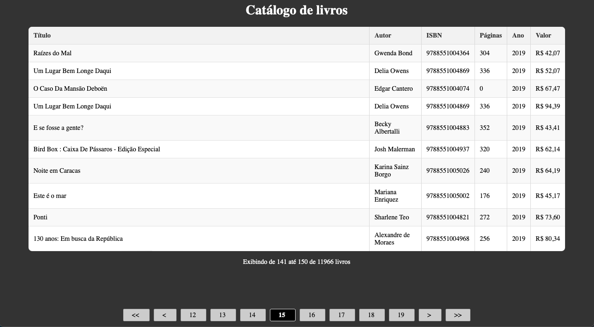

 # Informações sobre o projeto
 ## Requisitos
 Trabalho para entrega até o dia da prova. 
Deve ser feito em Node.js uma aplicação de uma página que apresente os livros paginados conforme orientação e imagem anexa.
O projeto deve ser hospedado no GitHub como projeto público e o link do repositório compartilhado comigo para que eu possa executar na minha máquina.
O projeto deve estar completo, incluindo o package.json para que eu possa instalar as dependências.
#
## Modelo proposto 

# Como rodar o projeto
## Backend
1. Abrir terminal na raiz da pasta backend
2. Rodar "npm install" no terminal para instalar dependências
3. Rodar "npm run dev" no terminal para iniciar o servidor para habilitar as rotas para consumo da API
4. Ele roda por padrão na url http://localhost:3008/
5. Deixe ele rodando em background
## Frontend
1. Abrir terminal na raiz da pasta frontend
2. Rodar "npm install" no terminal para instalar dependências
3. Rodar "npm start" no terminal para iniciar o serviço web
4. Ele roda por padrão na url http://localhost:3000/
5. Então voce pode acessar a url acima ( * Geralmente depois de iniciar o serviço web ele abre o navegador automaticamente )
## MongoDB
É necessario ter um banco de dados com:
- Database = livros
- Collection = livro 
- Com a estrutura de dados:

	{
		"_id": "66303bf6367f5006f597d669",
		"titulo": "A Convenção Das Aves",
		"autor": "Ransom Riggs",
		"isbn": "9788551006245",
		"paginas": 320,
		"ano": 2020,
		"valor": 60
	}
